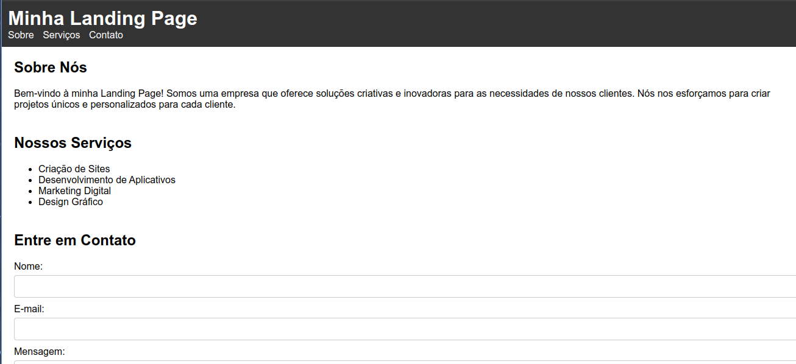

# Landing Page

Este repositório contém o código fonte para uma Landing Page simples criada usando o ChatGPT, um modelo de linguagem natural baseado na arquitetura GPT-3.5 da OpenAI. A página de destino apresenta um layout moderno e limpo, com conteúdo gerado pelo modelo ChatGPT, que pode ser personalizado para atender às necessidades específicas do usuário. 

